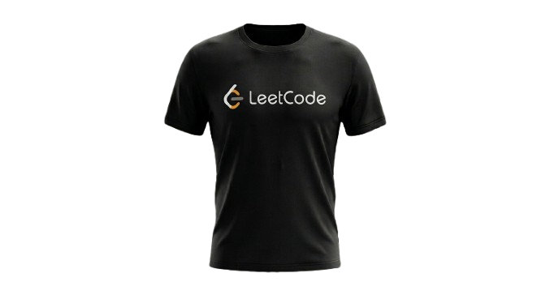

<div align="center">

# 🤖 AJEET SINGH

### AI & Machine Learning Engineer | Deep Learning | NLP | Computer Vision


</div>

---

# 🌌 About Me

```python
class AjeetSingh:

    def __init__(self):
        self.location = "Lucknow, India"
        self.degree = "B.Tech CSE (AI & ML)"
        self.cgpa = "8.10/10"
        self.focus = [
            "Artificial Intelligence",
            "Machine Learning",
            "Deep Learning",
            "Computer Vision",
            "NLP",
            "Large Language Models"
        ]

    def mission(self):
        return "Building AI Systems That Solve Real Problems"

me = AjeetSingh()
```

---

# 🚀 Current Journey

🎓 B.Tech CSE (AI & ML)

🧠 Exploring LLMs & Agentic AI

📊 Building AI-powered applications

🔍 Looking for Research Internships

⚡ Solved 200+ DSA Problems

🌱 Learning Advanced Deep Learning

---

# 🛰️ Tech Arsenal

### Programming

<p>

</p>

### AI / ML

<p>

</p>

**Libraries**

```text
OpenCV
Scikit-Learn
HuggingFace
NLTK
NumPy
Pandas
MediaPipe
```

### Web Development

<p>

</p>

### Databases

<p>

</p>

### Tools

<p>

</p>

---

# 🧠 Research Interests

🔹 Artificial Intelligence

🔹 Deep Learning

🔹 Computer Vision

🔹 Natural Language Processing

🔹 Large Language Models

🔹 Generative AI

🔹 Agentic AI Systems

🔹 Retrieval Augmented Generation

---

# 🔥 Featured Projects

## 🏏 AI Cricket Coach

> AI-powered cricket performance analysis system.

### Features

✅ Pose Estimation using MediaPipe

✅ Joint Angle Detection

✅ Real-Time Video Analysis

✅ LLM Generated Coaching Feedback

✅ Performance Analytics Dashboard

### Tech Stack

```text
Python
OpenCV
MediaPipe
LLMs
Streamlit
```

---

## 💬 AI Chatbot with NLP

### Features

✅ Intent Recognition

✅ Transformer Models

✅ Dynamic Responses

✅ Ethical AI Safety Filters

### Tech Stack

```text
Python
NLTK
HuggingFace
Transformers
```

---

## 🌦️ CloudPoint Weather App

### Features

✅ Live Weather Forecast

✅ OpenWeather API

✅ Google Maps Integration

✅ Responsive Dashboard

-----

# 🏆 Achievements

🏅 Web Development Internship - Softpro India

🏅 AI/ML Project Development

🏅 200+ DSA Problems Solved

🏅 Open Source Contributor

🏅 Research-Oriented Learning

---

# 🎯 2026 Goals

☑ Build Advanced AI Agents

☑ Publish Research Work

☑ Secure IIT Research Internship

☑ Contribute to Open Source AI

☑ Master Deep Learning

---

# 🌐 Connect With Me

<p align="center">

<a href="YOUR_LINKEDIN_LINK">

</a>

<a href="YOUR_GITHUB_LINK">

</a>

<a href="YOUR_PORTFOLIO_LINK">

</a>

</p>

---

<div align="center">

# ⚡ Building Intelligent Systems For Real World Impact ⚡

### "Transforming Data Into Intelligence"

## **👕 LeetCode DSA Problems Solved**

<p align="center" style="background-color: #000000; padding: 20px;">
  <marquee behavior="alternate" direction="left" scrollamount="5" width="100%">
    
  </marquee>
</p> 
</div>
<div align="center">
                              ## 👋 Welcome to my GitHub!🎯 Glad you stopped by to explore my code journey🌐
</div>
